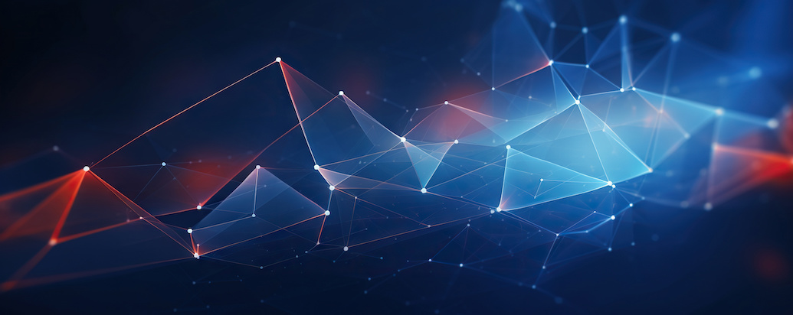

{alt="3D media"}

# 3D Digitisation Methods for Material Culture

## Aim of this session

To learn about different types of digital data which can be used
to record material culture.

The lesson presents basics on multi-dimensional data types,
so learners understand the difference between formats, file storage types,
as well as having basic literacy to name files. It allows
learners to understand what is a 3D model, and the basics of
its data structure.

The lesson also presents portable and non-portable 
methods available for digitisation
of information physical objects and environments, mostly recording
surface details, including shape and colour in some cases.

## Learning outcome(s)

By the end of this lessons learners will be able to:

- Explain which are the different types of data. 
- Describe the differences between raster and vectorised data types.
- Communicating what is a 3D model.
- List various techniques to create 3D models
of objects and environments.

## Prerequisite knowledge level

Basic literacy on:

- Digital photography
- Image processing
- Dealing with large amounts of files 

## Targeted expertise level

Basic to medium expertise on digital photography and handling information in PCs.

<!--
This is a new lesson built with [The Carpentries Workbench][workbench]. 

[workbench]: https://carpentries.github.io/sandpaper-docs

-->
## Setup and Structure
