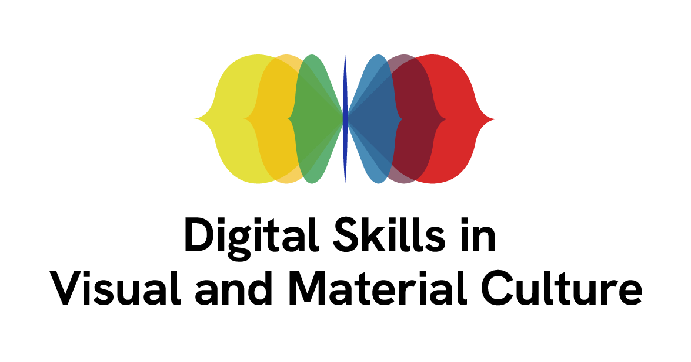

In this lesson we will use online resources as well as the [Digitisation Planner](https://www.heritagefund.org.uk/sites/default/files/media/attachments/Digitisation%20project%20planner%20and%20handbook.pdf) from the National Heritage Lottery Fund website. Please download the Planner (and if you wish you can print it as well) to use during the lesson.  

## Software Setup

No Software setup for this lesson

The tutorial is built with [The Carpentries Workbench](https://carpentries.github.io/sandpaper-docs/), as part of the training activities of the [AHRC-funded network service on Digital Skills in Visual and Material Culture](https://www.culturedigitalskills.org).

{width=50% alt="logo"}

