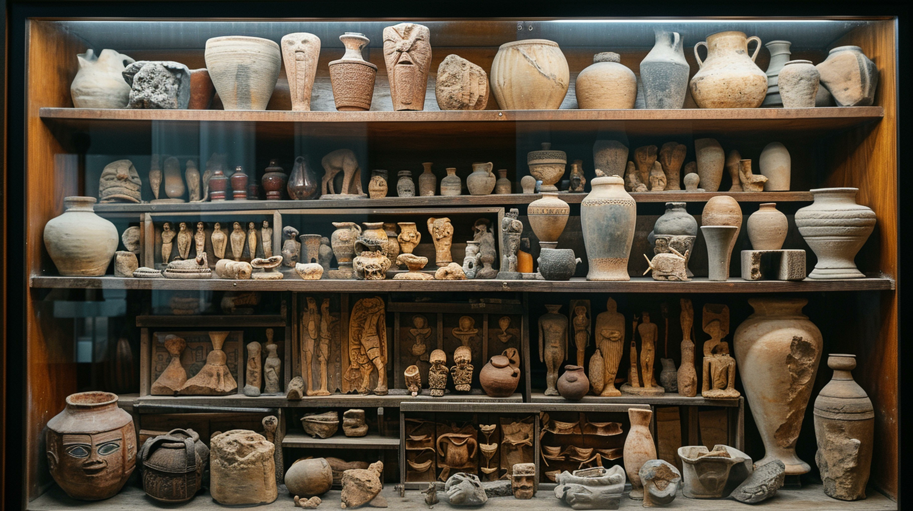

:::::::::::::::::::::::::::::::::::::: questions 

- This session explores material culture and various approaches for studying objects, while also looking at the use of media to represent information related to material culture.

::::::::::::::::::::::::::::::::::::::::::::::::

## Definition 

**Material culture** constitutes an interdisciplinary domain looking into the connections between individuals and the objects they produce. This field spans the creation, history, preservation, and interpretation of objects, involving the examination of tangible artefacts and their significance. It draws on a spectrum of disciplines, including art history, archaeology, anthropology, ethnography, history, and heritage studies.

{alt="pixels"}

Encompassing a diverse array of tangible objects shaped or altered by human hands, material culture ranges from buildings and architectural elements to textiles, books, decorative objects, instruments, and everyday items. Material culture explores the meaning of artefacts their use, lifespan and associations within various social, historical and political contexts.

### Intersection with Cultural Heritage

Material culture is a component of cultural heritage, contributing to the tangible aspects of a group's legacy. 

While not all material culture is part of cultural heritage, the intersection lies in the fact that cultural heritage includes both tangible (material culture) and intangible elements such as knowledge, poems, myths, dance or language. Together, they form the cultural practices and expressions of a particular group.

### Material culture study

Examining material culture holds significance as it offers valuable insights into the history, beliefs, and practices of communities and societies. This exploration aids in understanding how individuals shape objects and are influenced by them in several contexts, impacting social relations, work dynamics, and cultural identity. The study of material culture plays a crucial role in heritage preservation and interpretation, stimulates creativity, and acts as a bridge between academic knowledge and public understanding.

Key issues in studying material culture include:

- the challenge of interpreting objects' meanings
- understanding the contexts in which they were produced and used
- recognising the dynamic nature of their significance over time
- looking at the preservation of objects, including the practices involved in it
- ethical considerations around the objects and their lives
- potential biases introduced by cultural, political, or economic factors.

The contribution of material culture studies is also multifaceted. Its impact is evident in domains such as material citizenship (acknowledging the politics of things); stewardship (caring for culturally significant items); insightful scholarship on the history of object-making and usage; creativity in material culture; and fostering common ground between the public and academia.

### Approaches towards material culture

The two main approaches towards objects and material culture, identified by Bernard Herman (1992) are the "object-centred" approach, which focuses on the physical attributes of the object itself, and the "object-driven" approach, which emphasises understanding how objects relate to the cultures and peoples that create and use them. These approaches involve detailed description and contextualisation, respectively.

#### Object-centred

**Focus:**

-	**Object attributes**: This approach centres on the physical attributes and characteristics of the object itself.
- **Description**: It involves a detailed and focused description of the object, including its materials, size, colours, texture, weight, shape, design, style, decorative status, and provenance.
-	**Creation process**: It explores how the object was made, with a focus on the materials and techniques employed.
-	**Purpose**: It seeks to understand the object in terms of its intended purpose and function.

**Significance:**

-	**Materiality**: Emphasises the material aspects of the object.
-	**Classification**: Aids in categorising objects, identifying artistic styles, and attributing works to specific artists or periods.

#### Object-driven

**Focus**:

-	**Context and meaning**: This approach shifts the focus towards understanding how objects relate to the cultures and people that create and use them.
-	**Contextualisation**: Investigates the broader context in which objects are located and used.
-	**Function and symbolism**: Explores the changing meanings of objects within specific social and cultural practices.
-	**Cultural significance**: Considers how objects reflect the values and beliefs of the societies that produced them.

**Significance**:

-	**Dynamic nature**: Recognises the dynamic nature of the meanings of objects over time and space.
-	**Cultural insights**: Provides insights into societal values, beliefs, and practices.
-	**Agency**: Acknowledges that objects can have an active role in creating meaning rather than being passive.

In summary, the object-centred approach focuses on the **materiality** and **specific attributes** of objects, while the object-driven approach emphasises the broader **cultural, social, and historical contexts** in which these objects exist and gain **meaning**.

Please note that object-centred and object-driven approaches are not necessarily mutually exclusive, and they can overlap. Object-centred approaches start with a close examination of the object and work outwards, while object-driven approaches start with the broader context and then delve into a greater understanding of the object. Combining both approaches allows for a more comprehensive understanding of material culture, considering both the intrinsic qualities of objects and their dynamic relationships with cultural and social contexts.

## Object biographies

Object biographies refer to the conceptualisation of objects having life cycles, from conception and creation to use, appreciation, and eventual termination or afterlife. Like people, objects go through stages, acquiring new identities, meanings, and travels. Object biographies highlight the dynamic and evolving nature of objects within cultural and historical contexts.

{alt="pots"}

Some key aspects of the objects’ biographies can be found below.

### Conception and creation:

-	Like birth: Objects are conceived, designed, and created, akin to the birth or initiation phase in a human life.
-	Intention and purpose: The process involves the intentions of the creators, the purpose for which the object is made, and the cultural or social context of its creation.

### Use, consumption, and appreciation:

-	Like life and growth: Objects, like living beings, have a period of use and consumption. They are employed for various purposes, appreciated, and contribute to human activities and experiences.
-	Utility and meaning: Objects serve utilitarian functions while also accumulating meanings and associations based on how they are used and valued by individuals or communities.

### Disintegration, or afterlife:

-	Like death or transformation: At the end of their use or relevance, objects may undergo processes of dissolution, disintegration, or transformation.
-	Afterlife in museums: Some objects may find a form of afterlife in museums, where they are preserved, displayed, and continue to contribute to cultural understanding.

### Travels and identity:

-	Like journeys in life: Objects, like people, can go on journeys. Through travels, they acquire new identities and meanings in different cultural, geographical, or historical contexts.
-	Cultural significance: The travels of objects may contribute to their cultural significance and influence their interpretations.

### Forces shaping destiny:

-	External influences: Throughout their existence, objects are subjected to wider forces in the world that shape their destinies. This includes cultural, social, economic, and political influences.
-	Adaptation: Objects, like living organisms, may adapt to changing circumstances and acquire new roles or meanings.

### Object biographies and interpretation:

-	Understanding change: Object biographies help in understanding how the meanings and uses of objects change over time and in different cultural contexts.
-	Cultural dynamics: They highlight the dynamic nature of the relationships between people and objects, as well as the cultural dynamics that influence these relationships.

Essentially, object biographies offer a narrative framework for exploring the life trajectories of objects, providing a dynamic perspective on their existence within human societies. This approach acknowledges the agency of objects and their roles in shaping and reflecting cultural practices, beliefs, and identities.

:::: challenge

Look at the different aspects of objects’ biographies and think about the objects that you study and document within the context of your research. What are the key aspects that you focus on and what is something that you would like to further expand on?
:::: 

## Capturing and sharing material culture 

Digital documentation enhances our understanding of material knowledge by creating accessible records of objects. Deploying technologies such as digital imaging, 3D scanning, and databases, researchers and practitioners can capture and disseminate details about artefacts, facilitating the study and preservation of material culture. Moreover, digital documentation enables public access and engagement, advancing discussions on diverse interpretations, even those involving contested narratives within cultural heritage.

](fig/scottish_boat_workshop_sketchfab.png){alt="boat 3D image"}

Media, including textual recordings, imagery, 3D scans and visual reconstructions of the past, contribute to communicating material culture by visually representing objects and conveying knowledge. However, we should always keep in mind that such media essentially constitute subjective means of representation, introducing potential distortions and bias through a process of agency. When looking at media as vehicles of representation, there should be careful consideration of how such media portray objects, events, communities, societies and their identity within specific contexts over time.

## Resources and further reading

Augustat, C. (2020). A Play in the Field of Words: From Material Culture to/and Cultural Heritage. INDIANA - Estudios Antropológicos sobre América Latina y el Caribe. Vol. 37 Núm. 2 (2020). Retrieved from: https://doi.org/10.18441/ind.v37i2.237-245

De Cunzo, L. A., & Roeber, C. D. (Eds.). (2022). The Cambridge Handbook of Material Culture Studies. Cambridge: Cambridge University Press.

Herman, B. L. (1992). The Stolen House.  Charlottesville and London: The University Press of Virginia.

Papadopoulos, C. (2020). Course: Unit 1: An introduction to 3D heritage. dariahTeach: Open Educational Resources for the Digital Arts and Humanities. Retrieved from: https://teach.dariah.eu/course/view.php?id=55&section=1

The Open University. (2014). An introduction to material culture. The open university. Retrieved from: https://www.open.edu/openlearn/history-the-arts/visual-art/an-introduction-material-culture/content-section-0?active-tab=content-tab  

Tilley, C. (2012). Handbook of material culture. Sage Publications.

